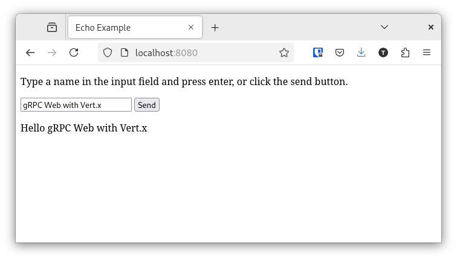
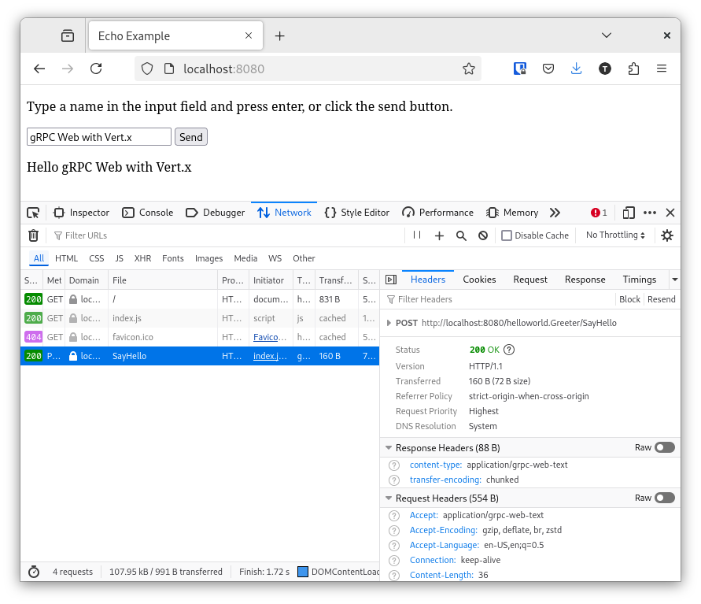

= Building a gRPC Web service
:page-permalink: /
:page-github: vertx-howtos/grpc-web-howto

ifdef::env-github[]
image:https://github.com/vertx-howtos/grpc-web-howto/workflows/Publish%20the%20how-to/badge.svg["Build Status",link="https://github.com/vertx-howtos/grpc-web-howto/actions?query=workflow%3A%22Publish+the+how-to%22"]
endif::env-github[]

This document will show you how to build a browser/server application with Vert.x and https://github.com/grpc/grpc-web[gRPC Web].

== What you will build

The application involves a client, the browser, and a Vert.x server:

* the user types a name in a text field and clicks the send button
* the browser sends the name to the server using the gRPC Web protocol
* the server replies with a greeting
* the browser displays the greeting

On the server side, you will create a Vert.x gRPC server service that:

* implements a gRPC server stub
* configures an HTTP server replying to both gRPC Web and static file requests

On the client side, you will create a web page that uses the gRPC Web Javascript client.

== What you need

* A text editor or an IDE
* Java 17 or higher

You don't have to install `protoc` or the protoc plugins like vertx-grpc-protoc-plugin2, protobuf-javascript and protoc-gen-grpc-web as they will be managed by a Maven plugin.

== Create the project

=== gRPC service definition

The gRPC `Greeter` service consists in a single `SayHello` rpc method.
The `HelloRequest` message contains the name sent by the client.
The `HelloReply` message contains the greeting generated by the server.

ifdef::env-github[]
link:src/main/proto/service.proto[`service.proto` file]
endif::env-github[]
ifndef::env-github[]
[source,protobuf]
.`service.proto` file
----
include::src/main/proto/service.proto[]
----
endif::env-github[]

=== Code generation

From the service definition, several files must be generated:

* Java message and server classes
* Javascript files
* gRPC Web specific (Javascript) files.

The `protoc` invocation is managed with the https://github.com/ascopes/protobuf-maven-plugin[`protobuf-maven-plugin`].

ifdef::env-github[]
link:pom.xml[Maven POM file]
endif::env-github[]
ifndef::env-github[]
[source,xml]
.Code generation with `protobuf-maven-plugin`
----
include::pom.xml[tags="protobuf-maven-plugin",indent=0]
----

<1> We choose to use the `CommonJS` modules generation style instead of closures.
endif::env-github[]

=== The server side

We need some dependencies for the project to compile:

ifdef::env-github[]
link:pom.xml[Maven POM file]
endif::env-github[]
ifndef::env-github[]
[source,xml]
.Project dependencies
----
include::pom.xml[tags="dependencies",indent=0]
----
endif::env-github[]

The server side code fits in a single `ServerVerticle` class.

First, the gRPC server stub implementation.

ifdef::env-github[]
link:src/main/java/io/vertx/howtos/grpcweb/ServerVerticle.java[Verticle file]
endif::env-github[]
ifndef::env-github[]
[source,java]
.gRPC server stub implementation
----
include::src/main/java/io/vertx/howtos/grpcweb/ServerVerticle.java[tags="grpcServer",indent=0]
----
endif::env-github[]

There is nothing specific to gRPC Web here.

NOTE: `GrpcServer` enables the gRPC Web protocol support by default.

Then we have to configure a Vert.x Web `Router` to accept both gRPC Web and static file requests.

ifdef::env-github[]
link:src/main/java/io/vertx/howtos/grpcweb/ServerVerticle.java[Verticle file]
endif::env-github[]
ifndef::env-github[]
[source,java]
.Router and server configuration
----
include::src/main/java/io/vertx/howtos/grpcweb/ServerVerticle.java[tags="routerAndServer",indent=0]
----

<1> All requests with `application/grpc-web-text` content type will be handed over to the `grpcServer`.
<2> All other `GET` requests will be handled by a Vert.x Web `StaticHandler`.
endif::env-github[]

=== The client side

Before writing code, we must set up the project to build client side code.
For simplicity, we choose to use the https://github.com/mvnpm/esbuild-maven-plugin[`esbuild-maven-plugin`].
In a few words, it's a Maven plugin that wraps https://esbuild.github.io/[`esbuild`], a fast bundler for the web.

A couple of dependencies are required, which we grab as Maven dependencies thanks to https://mvnpm.org/[`mvnpm`]:

* https://www.npmjs.com/package/google-protobuf/v/3.21.4[`google-protobuf`]
* https://www.npmjs.com/package/grpc-web/v/1.5.0[`grpc-web`]

ifdef::env-github[]
link:pom.xml[Maven POM file]
endif::env-github[]
ifndef::env-github[]
[source,xml]
.Client code build with `esbuild-maven-plugin`
----
include::pom.xml[tags="esbuild-maven-plugin",indent=0]
----

<1> `webroot` is the default base directory from where the Vert.x Web `StaticHandler` serves static files.
endif::env-github[]

The user interface code fits in a single `index.html` file.

ifdef::env-github[]
link:src/main/resources/webroot/index.html[HTML file]
endif::env-github[]
ifndef::env-github[]
[source,html]
.User interface
----
include::src/main/resources/webroot/index.html[indent=0]
----

<1> Import the `sayHello` function from our Javascript module (see below).
<2> Make the `sayHello` function global.
endif::env-github[]

Last but not least, let's implement the `sayHello` function:

ifdef::env-github[]
link:src/main/web/index.js[Application JS file]
endif::env-github[]
ifndef::env-github[]
[source,javascript]
.Using the gRPC Web client
----
include::src/main/web/index.js[indent=0]
----

<1> Import the `HelloRequest` object from the Javascript generated file.
<2> Import the `GreeterClient` object from gRPC Web (Javascript) generated file.
<3> Configure the client to send requests to the web server.
endif::env-github[]

== Running the application

You can run the application with Maven:

[source,shell]
----
./mvnw compile exec:java
----

You should see:

----
Server started, browse to http://localhost:8080
----

You can now browse to http://localhost:8080 and follow the instructions.

Use the dev tools of your browser to inspect the gRPC Web traffic.

== Summary

This document covered:

. implementing a Vert.x web server that replies to both static file and gRPC Web requests,
. creating a web page that uses the gRPC Web client.

== See also

* https://vertx.io/docs/vertx-grpc/java/[Vert.x gRPC documentation]
* https://github.com/grpc/grpc-web[gRPC Web project]
